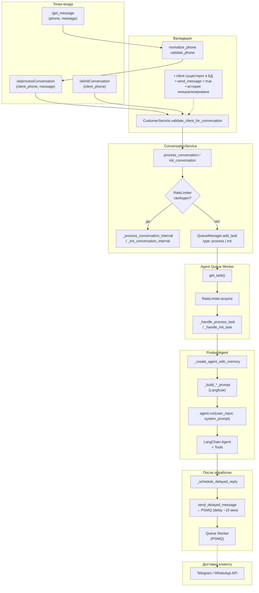
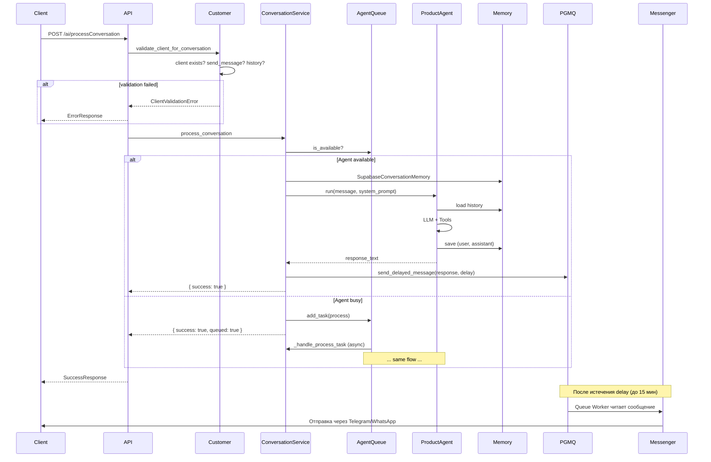

# Диаграмма пайплайна клиента

## Обзор

Система Myaso — AI-ассистент для магазина мясной продукции. Клиенты общаются через Telegram/WhatsApp, запросы поступают в API, обрабатываются агентом и ответы доставляются обратно.

## Точки входа (API)

```
┌─────────────────────────────────────────────────────────────────────────────┐
│                           ВХОДЯЩИЕ ЗАПРОСЫ                                   │
├─────────────────────────────────────────────────────────────────────────────┤
│  POST /get_message          │  Внешний webhook (WhatsApp/Telegram)          │
│  { phone, message }         │  → Валидация телефона → /ai/processConversation│
├─────────────────────────────────────────────────────────────────────────────┤
│  POST /ai/processConversation│  Обработка сообщения клиента                   │
│  { client_phone, message }   │  (требует initConversation)                   │
├─────────────────────────────────────────────────────────────────────────────┤
│  POST /ai/initConversation   │  Инициализация новой беседы                   │
│  { client_phone }            │  Первое приветствие с предложением товаров     │
├─────────────────────────────────────────────────────────────────────────────┤
│  DELETE /ai/resetConversation │  Сброс истории диалога                        │
│  { client_phone }            │  Очистка памяти для нового контекста          │
└─────────────────────────────────────────────────────────────────────────────┘
```

## Диаграмма пайплайна (Mermaid)



## Последовательность обработки сообщения



## Компоненты

| Компонент | Описание |
|-----------|----------|
| **CustomerService** | Проверка клиента: есть в БД, send_message включён, есть история |
| **ConversationService** | Оркестрация: очередь задач, создание агента, построение промптов |
| **AgentQueueWorker** | Обработка задач из in-memory очереди, rate limit (1 concurrent) |
| **ProductAgent** | LangChain-агент с инструментами, LLM (OpenRouter), память |
| **PGMQ** | Очередь сообщений (PostgreSQL) — хранение ответов агента для отложенной доставки (~15 мин). Ответы попадают в очередь через `send_delayed_message` после генерации агентом.